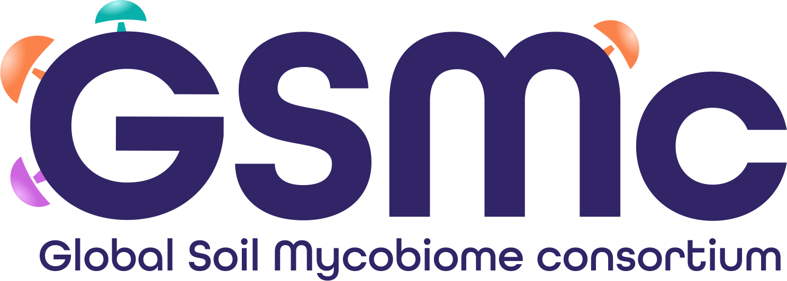

 

# About

Fungi represent an immensely diverse group of organisms that play a crucial role in providing a wide range of ecosystem services. Despite their importance, fungi have received far less attention compared to animals and plants. As a result, we have limited knowledge about the distribution patterns and conservation needs of fungi.  

**The Global Soil Mycobiome consortium (GSMc)**, led by researchers in the [Mycology and Microbiology Center (MMC), University of Tartu](https://mmc.ut.ee/home-1) was established in 2015 to fill this gap in our understanding. Building on the success of [an earlier global soil fungal survey](https://doi.org/10.1126/science.1256688), the GSMc has significantly expanded the geographical and habitat coverage of soil fungi.  

The current dataset includes 3,200 composite samples (comprising a total of 127,263 sub-samples) collected from sites located across 108 different countries, making it the largest and most comprehensive collection of soil fungal distribution data acquired using standardized methods.

The GSMc dataset is publicly accessible at the [PlutoF biodiversity management platform](https://plutof.ut.ee), providing researches from around the world to access this invaluable resource. Furthermore, the GSMc aims to acknowledge contributors by offering scientific currency in the form of co-authorships.  

The GSMc dataset stands out from preceding public datasets and databases in numerous significant aspects:  

1. The geographical breadth and number of individual samples (> 125,000) are by far the greatest to date;  

2. The molecular barcode covers both the entire ITS region and the V9 variable region of the 18S rRNA gene. This combination provides a much greater taxonomic resolution than the ITS1 and ITS2 subregions alone;  

3. All samples have been collected and processed following the same protocol; 

4. All molecular analyses, including PCR and library preparation for high-throughput sequencing, have been performed in a single laboratory (Mycology and Microbiology Center, University of Tartu); 

5. To ensure accuracy, the data has been carefully quality-filtered by checking for potential chimeras and contaminants manually for each sequencing run; 

6. The dataset is enriched with the latest taxonomic and functional annotations, and sample metadata, allowing users to reinterpret and analyze the data in new ways;  

7. The dataset is freely available to all researchers in a ready-to-use format to encourage incorporation of soil fungi into macroecological analyses and boost understanding of the diversity and distribution of fungi.  

A new release, complemented by a short data paper, is planned for the year 2024. 
Stay updated and get early access by following [@tedersoo](https://twitter.com/tedersoo?s=20) at X (ex-Twitter). 

# Funding

Funding of the fieldwork and shipping comes from the GSMc partners. Molecular work is performed by students in the MMC lab and is funded by the following grants: Estonian Science Foundation (grants PRG632, PRG1615), MOBERC, EEA and Norway grants, Novo Nordisk Foundation and King Saud University (DSFP-2021-2023).
